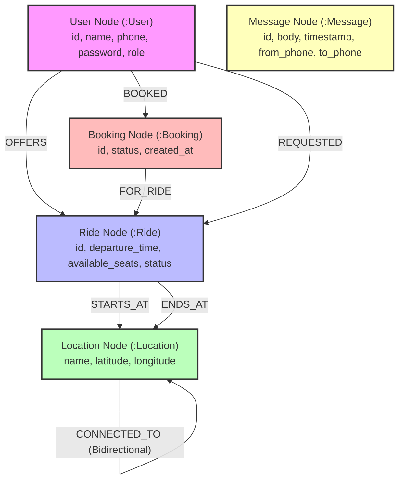
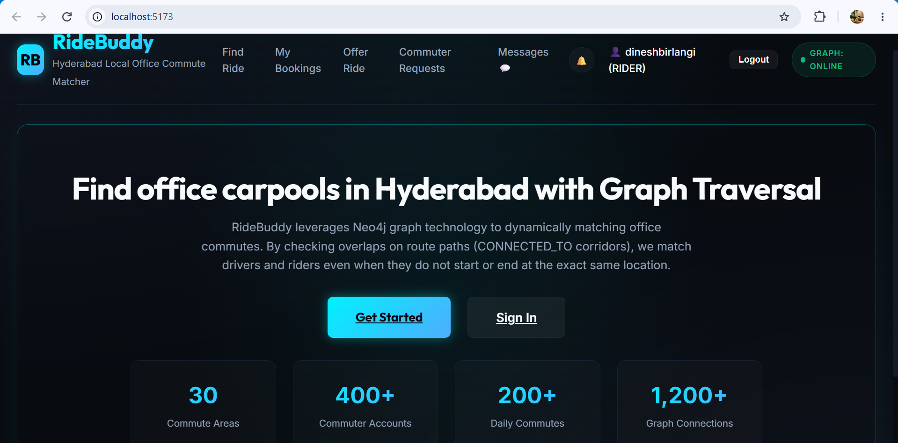
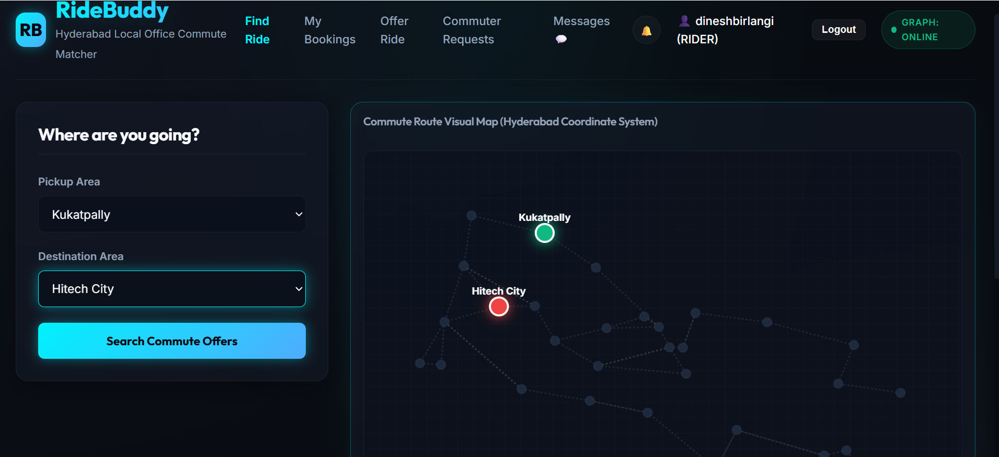
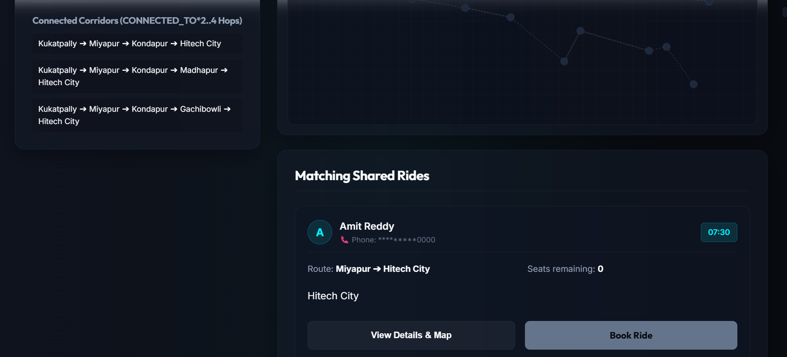
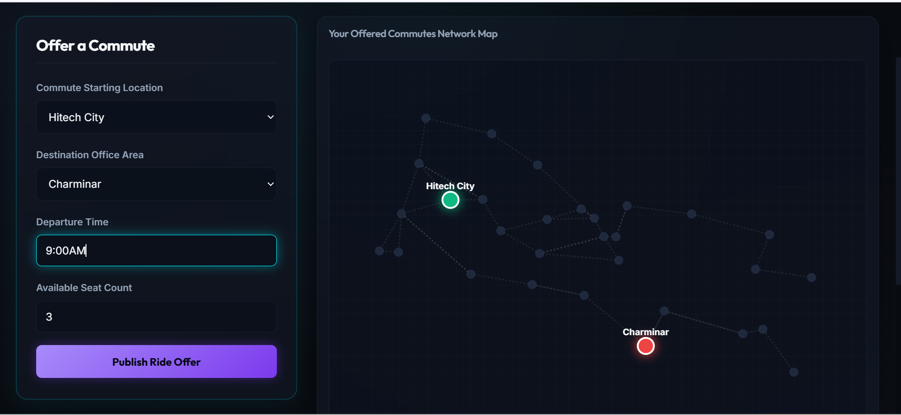
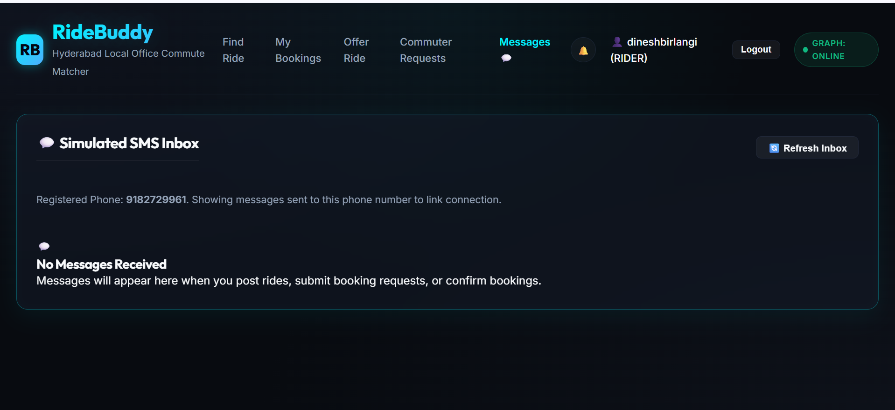
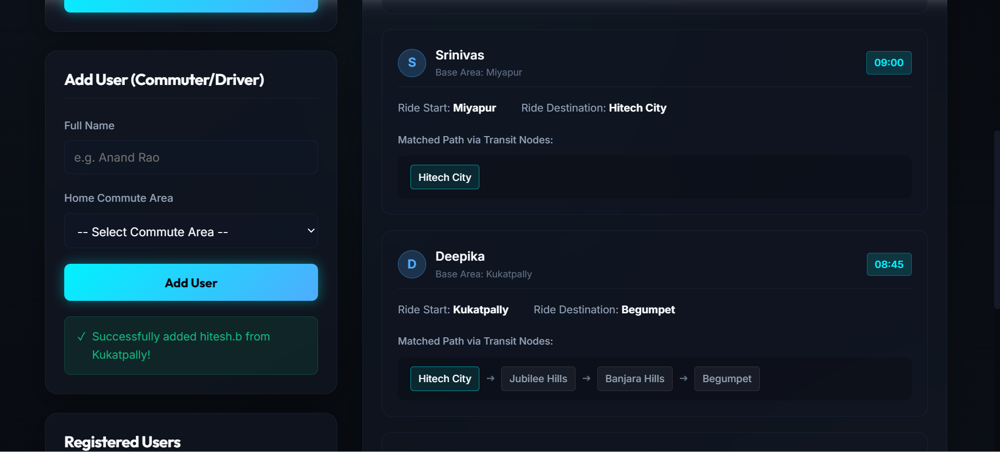
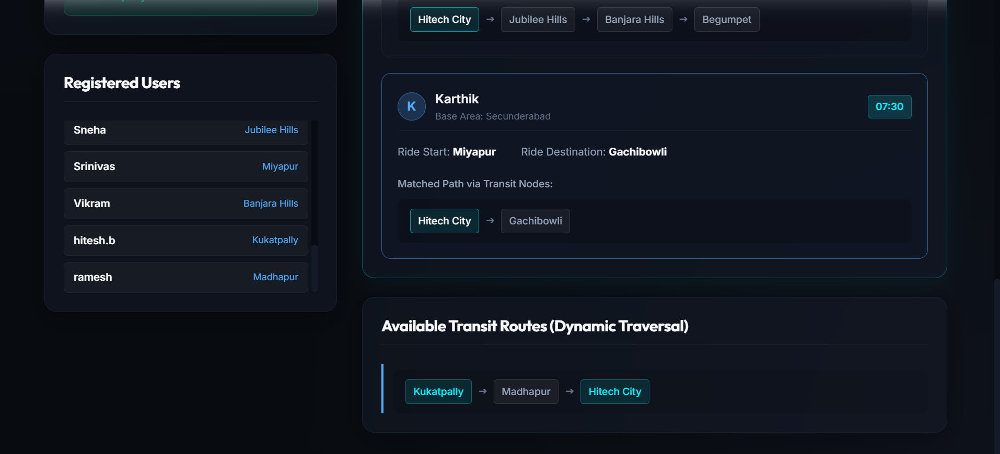
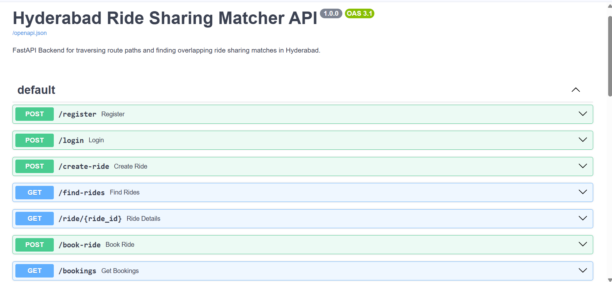
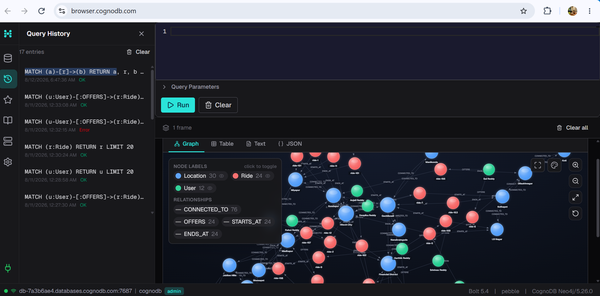

# RideBuddy (HydRider) 🚗

RideBuddy (also known as **HydRider**) is a localized, graph-powered carpooling and ride-sharing web application designed specifically for Hyderabad's busy IT corridors (like Miyapur, Kukatpally, Madhapur, Hitech City, Gachibowli, and Financial District). 

Instead of requiring commuters to have the exact same start and end locations, RideBuddy utilizes dynamic graph route-traversal to match riders with drivers whose routes overlap in the correct direction and sequence. This makes carpooling highly flexible, reduces heavy transit gridlocks, and minimizes commute emissions.

---

## 🌐 Why a Graph Database? (Relational vs. Graph)

Commute path matching is fundamentally a graph-structured problem. Traditional relational databases (SQL) struggle to solve this efficiently at scale.

### 1. The Relational Database Problem (SQL Joins)
In a relational model, transit links between areas are stored as a flat table of connections `(from_location, to_location)`.
* **Recursive Joins**: To find a path from Location $A$ to Location $D$ via intermediate nodes $B$ and $C$ requires recursive Common Table Expressions (CTEs) or multiple self-joins. As path lengths increase, query performance degrades exponentially.
* **Complex Sub-Path Evaluation**: Determining if a rider's desired commute path ($B \rightarrow C$) is a sequential segment of a driver's longer route ($A \rightarrow B \rightarrow C \rightarrow D$) requires fetching the entire path, parsing it in the application layer, and matching index orders. This creates high CPU overhead on backend servers.

### 2. The Graph Database Advantage (CognoDB/Neo4j)
Graphs use **Index-Free Adjacency**. Every location is a Node, and corridors are direct Pointers (`CONNECTED_TO` relationships) to adjacent nodes. Finding paths is an $O(1)$ traversal per hop.
* **Single Cypher Query**: RideBuddy calculates route overlaps and sequences in a single, high-performance Cypher query at the database layer. This ensures instant matching and scales linearly.

---

## 📊 Data Model Diagram

The application database is structured around the following graph schema:



---

## 🛠️ Setup & Running Locally

Follow these steps to set up, configure, seed, and run the RideBuddy project locally.

### Step 1: Create a CognoDB Instance
1. Go to the [CognoDB Cloud Console](https://console.cognodb.com) and create a free account.
2. Spin up a new database instance.
3. Once created, note down your **Database URI** (starts with `bolt+s://`), the default username (`cognodb`), and the **password** generated for your instance.

### Step 2: Handle Environment Variables
1. Navigate to the `backend/` directory.
2. Create a file named `.env` and enter your database credentials:
```env
NEO4J_URI=bolt+s://db-xxxxxxxx.databases.cognodb.com
NEO4J_USER=cognodb
NEO4J_PASSWORD=your_password_here
```

### Step 3: Run the Backend
1. Open a terminal and navigate to the backend folder:
   ```bash
   cd backend
   ```
2. Create and activate a Python virtual environment:
   * **Windows (PowerShell)**:
     ```powershell
     python -m venv .venv
     .venv\Scripts\Activate.ps1
     ```
   * **Windows (Cmd)**:
     ```cmd
     python -m venv .venv
     .venv\Scripts\activate
     ```
   * **macOS / Linux**:
     ```bash
     python3 -m venv .venv
     source .venv/bin/activate
     ```
3. Install backend dependencies:
   ```bash
   pip install -r requirements.txt
   ```
4. **Seed the database**: Run the seeding script to clean your database and populate it with 30 Hyderabad locations, route networks, 400 Indian user accounts, 200 commutes, and 150 simulated bookings:
   ```bash
   python seed.py
   ```
5. Start the FastAPI development server:
   ```bash
   uvicorn app.main:app --reload --port 8000
   ```
   *API will be hosting endpoints and interactive docs at [http://127.0.0.1:8000](http://127.0.0.1:8000).*

### Step 4: Run the Frontend
1. Open a new terminal window and navigate to the frontend folder:
   ```bash
   cd frontend
   ```
2. Install the frontend dependencies:
   ```bash
   npm install
   ```
3. Start the Vite development server:
   ```bash
   npm run dev
   ```
   *The application UI will run at [http://localhost:5173](http://localhost:5173).*

---

## ⚡ Main Cypher Queries Explained

### 1. Dynamic Overlapping Route Matcher
This query finds drivers whose active rides pass through the passenger's desired pickup (`$start_name`) and drop-off (`$end_name`) in the correct chronological order and direction:
```cypher
MATCH (start_loc:Location {name: $start_name})
MATCH (end_loc:Location {name: $end_name})
MATCH (u:User)-[:OFFERS]->(r:Ride {status: "ACTIVE"})
MATCH (r)-[:STARTS_AT]->(r_start:Location)
MATCH (r)-[:ENDS_AT]->(r_end:Location)

// Verify driver's commute path contains passenger's start and end in correct sequence
MATCH ride_path = (r_start)-[:CONNECTED_TO*0..4]->(start_loc)-[:CONNECTED_TO*1..4]->(end_loc)-[:CONNECTED_TO*0..4]->(r_end)

OPTIONAL MATCH (current_user:User {id: $current_user_id})-[:BOOKED]->(b:Booking)-[:FOR_RIDE]->(r)

WITH u, r, r_start, r_end, b, collect(ride_path)[0] AS shortest_ride_path

RETURN u.name AS driver_name,
       u.phone AS driver_phone,
       u.id AS driver_id,
       r.id AS ride_id,
       r.departure_time AS ride_time,
       r.available_seats AS available_seats,
       r_start.name AS ride_start,
       r_end.name AS ride_end,
       [n in nodes(shortest_ride_path) | n.name] AS route_nodes,
       b.status AS booking_status,
       b.id AS booking_id
```

### 2. Multi-Hop Connection Fallback Routes
If no direct overlapping rides exist, this queries the database to find alternative multi-hop routing paths between locations to suggest passenger transit steps:
```cypher
MATCH (a:Location {name: $start_name})
MATCH (b:Location {name: $end_name})
MATCH path = (a)-[:CONNECTED_TO*2..4]->(b)
RETURN [n in nodes(path) | n.name] AS route_nodes, length(path) as path_len
ORDER BY path_len ASC
LIMIT 5
```

### 3. Masking and Privacy Enforcement
To maintain commuter privacy, contact numbers remain masked until a booking request is accepted. This authorization state is resolved at the database query layer:
```cypher
MATCH (r:Ride {id: $ride_id})<-[:OFFERS]-(driver:User)
MATCH (r)-[:STARTS_AT]->(s:Location)
MATCH (r)-[:ENDS_AT]->(e:Location)

OPTIONAL MATCH (curr_user:User {id: $current_user_id})-[:BOOKED]->(b:Booking)-[:FOR_RIDE]->(r)
OPTIONAL MATCH path = (s)-[:CONNECTED_TO*0..4]->(e)

WITH r, driver, s, e, b, collect(path)[0] AS shortest_path

RETURN r.id AS ride_id,
       r.departure_time AS ride_time,
       r.available_seats AS available_seats,
       r.status AS ride_status,
       driver.id AS driver_id,
       driver.name AS driver_name,
       driver.phone AS driver_phone,
       s.name AS ride_start,
       e.name AS ride_end,
       b.status AS booking_status,
       b.id AS booking_id,
       // Authorization criteria: current user is the driver or has a CONFIRMED booking
       (driver.id = $current_user_id OR b.status = "CONFIRMED") AS is_authorized,
       [n in nodes(shortest_path) | n.name] AS route_nodes
```

---

## 📸 App Walkthrough & Demonstration

Below are screenshots demonstrating the application's core functionality, ordered sequentially:

### 1. Introduction to the Application
Overview of the application interface displaying current statistics and available commute metrics.


### 2. Ride Search Interface
Commuters can search for rides from a starting location to a destination.


### 3. Matched Rides & Profiles
Displays the list of matched rides along with driver profiles and overlapping route nodes.


### 4. Offering a Ride
Drivers can post a new ride, specifying start, end, departure time, and available seat capacity.


### 5. Commuter Messages & Request Inbox
Simulated inbox interface where ride requests and booking updates appear.


### 7. Adding Commuters & Drivers
Allows registering new users (drivers or riders) who commute daily along similar routes.


### 8. Registered Users Directory
Displays all registered commuter accounts and their details inside the application.


### 9. FastAPI Backend & API Documentation
The backend FastAPI server is running, hosting the interactive Swagger documentation page.


### 10. CognoDB Instance & Cypher Queries
The database instance is active, with a history of Cypher queries executed to test graph traversals manually.

